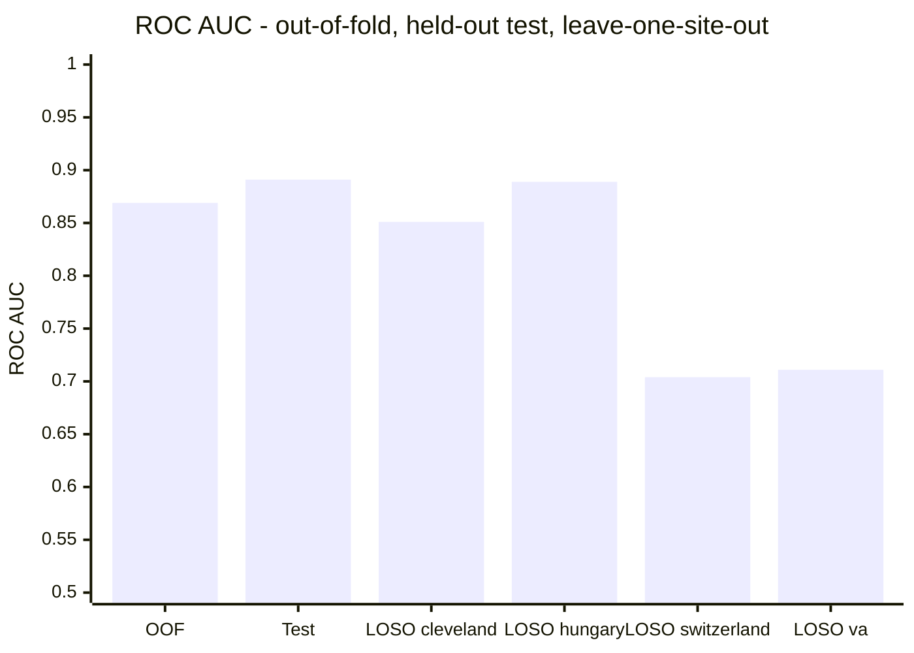
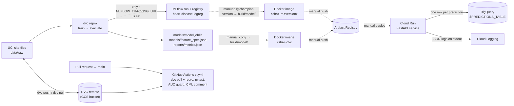

# Heart disease risk: cost-weighted screening model

An end-to-end ML project covering a calibrated logistic regression model on the four-site UCI heart-disease data, a reproducible DVC pipeline, MLflow tracking and registry, PR checks in CI, and a containerised FastAPI service with structured logs and prediction records in BigQuery.
The decision threshold comes from an explicit cost ratio, not 0.5.



OOF and test values come from `reports/metrics.json`, which is produced by `dvc repro`.
The leave-one-site-out (LOSO) values come from `notebooks/02-diagnostics.ipynb` (see [the model card](reports/model_card.md)).
Quote **OOF**, not test, as the headline number.

| Metric | Test (n=230) | OOF (n=688) | Where it comes from |
|---|---|---|---|
| ROC AUC | **0.891** | **0.869** | `reports/metrics.json` (`test_auc`, `oof_auc`). Test AUC is the CI regression gate |
| Average precision | 0.891 | 0.873 | `metrics.json` (`test_ap`); OOF printed by `evaluate` |
| Brier score | 0.131 | 0.144 | `metrics.json` (`test_brier`, `oof_brier`) |
| Recall @ t=0.20 | 0.984 | 0.971 | `metrics.json` (`test_recall`); OOF printed by `evaluate` |
| Precision @ t=0.20 | 0.687 | 0.684 | `metrics.json` (`test_precision`); OOF printed by `evaluate` |
| F1 @ t=0.20 | 0.809 | – | `metrics.json` (`test_f1`) |
| Accuracy @ t=0.20 | 0.743 | – | `metrics.json` (`test_accuracy`) |
| CV log-loss (tuning objective) | – | 0.450 | `reports/train_metrics.json` (`cv_log_loss`) |
| Decision threshold | 0.20 | 0.20 | `models/feature_spec.json` (`threshold`), derived from `params.yaml` |

Per-class precision and recall are in `reports/classification_report.txt`.

---

## For reviewers

**Stack:** Python 3.14, scikit-learn, FastAPI, DVC (GCS remote), MLflow, GitHub Actions + CML, Docker, Google Cloud (Workload Identity Federation, Artifact Registry, Cloud Run, BigQuery, Cloud Logging).

**Highlights.** Each claim points to the code or test behind it:

| What | Evidence |
|---|---|
| **Leakage fix.** Selecting features by missingness was originally done on the full dataset before the train/test split; it now sees training rows only. | `data.prepare()` / `select_features()`; `tests/test_data.py::test_select_features_sees_only_the_frame_it_is_given` |
| **The threshold comes from costs and is versioned with the model.** `cost_fp / (cost_fp + cost_fn)` → 0.20, written to `feature_spec.json`; it is never a literal in the service. | `train.cost_threshold()`; `tests/test_serve.py::test_threshold_comes_from_the_artifact_not_a_literal` |
| **Honest evaluation.** The headline is OOF, not the luckier test split. Leave-one-site-out shows the real generalisation gap (~0.70 AUC at two sites). | [reports/model_card.md](reports/model_card.md) |
| **Train/serve parity.** All 230 test rows score identically through the HTTP payload path and through the pipeline. Three silent skews were found and fixed while building the service (zero→NaN rules, `None` vs NaN, missing indicators). | `serve.to_frame()`; `tests/test_serve.py::test_whole_test_split_round_trips` |
| **Reproducibility and a regression gate.** `dvc.lock` pins data, code and params. Every PR re-runs the pipeline, fails if test AUC drops by more than 0.02, and posts a metrics/params diff. | `dvc.yaml`, `.github/workflows/ci.yml` |
| **CI without key files.** GitHub OIDC is exchanged via Workload Identity Federation; there are no service account keys in secrets. | `ci.yml` (`id-token: write`, `google-github-actions/auth`) |
| **Observability.** JSON logs with request ids and model version. Prediction log lines carry an input hash only; full rows go to BigQuery. | `logging_conf.py`, `predlog.py`, `serve.py` middleware |

**Topics worth discussing:**
- Why OOF and not test is the reported number.
- Missingness acting as a site proxy, and why the `chol`/`fbs` indicators were dropped.
- Why cluster-robust SEs with 4 clusters were rejected (a negative result, see the model card).
- The DVC-in-CI vs registry-for-release split (section 10).
- What is still manual ([Known gaps and next steps](#known-gaps-and-next-steps)).

**Quickest way to run it.** The DVC remote is private. Without access, put the four `processed.*.data` files from the public [UCI Heart Disease dataset](https://archive.ics.uci.edu/dataset/45/heart+disease) into `data/raw/heart+disease/`, then run the following after the setup in section 4:

```bash
# WSL, repo root, venv active
python -m disease_pred.train && python -m disease_pred.evaluate
python -m pytest -q --ignore=tests/test_notebooks.py
uvicorn disease_pred.serve:app          # http://127.0.0.1:8000/docs
```

---

## 1. What the model does

**Problem.** The model is a screening triage tool. Given a patient's clinical fields, it returns the probability of heart disease and a yes/no flag for follow-up.
The target is binary: `target = num > 0`.
It is a coursework/portfolio model, **not** a clinical device (see [reports/model_card.md](reports/model_card.md)).

**Data.** The data is the UCI heart-disease dataset, four `processed.*.data` files, one per site: Cleveland, Hungary, Switzerland and VA.
That is 920 rows before deduplication.
The files are tracked by DVC under `data/raw/heart+disease/` (see `params.yaml` → `data.files`).
`load_raw()` tags each row with its site.

**Cleaning.** `?` is read as missing.
`chol = 0` and `trestbps = 0` become NaN, because they are physiologically impossible (`data.zero_is_missing`).

**Feature selection.** Columns missing in more than 30% of *training* rows are dropped: `thal`, `slope` and `ca`.
This leaves 10 inputs: `age, trestbps, chol, thalach, oldpeak, sex, fbs, cp, restecg, exang`.

**Model.** A scikit-learn `Pipeline`:
1. `ColumnTransformer`:
   - median impute + scale for continuous columns
   - most-frequent impute for binary columns
   - most-frequent impute + one-hot encoding for nominal columns
   - `MissingIndicator` for `trestbps, thalach, oldpeak`
2. `LogisticRegression(solver="saga")` with an elastic-net grid over `C` × `l1_ratio`.

The grid is tuned on 5-fold CV log-loss. The selected values are `C = 0.316` and `l1_ratio = 0.0`, which is effectively ridge.

**Metrics.** ROC AUC is the headline metric and the CI gate.
Brier score backs the calibration claim that the threshold depends on.
Recall and precision at the chosen threshold show what the decision actually does.

**Cost-based threshold.** A missed diagnosis (false negative) is assumed to cost 4× an unnecessary follow-up (false positive). These costs are set in `params.yaml`:

```yaml
decision:
  cost_fp: 1.0
  cost_fn: 4.0
```

The Bayes-optimal cut for calibrated probabilities is:

```
threshold = cost_fp / (cost_fp + cost_fn) = 1 / (1 + 4) = 0.20
```

`train.cost_threshold()` computes it and `train.py` writes it into `models/feature_spec.json`.
The service reads it from there and never from a literal. Changing the cost ratio re-triggers the DVC `train` stage.

At t = 0.20 on the test split, 2 of 127 diseased patients are missed and 57 of 103 healthy patients are flagged. That asymmetry is the 4:1 ratio at work.

---

## 2. Architecture



Solid arrows are implemented in this repo. Dashed arrows are done by hand today; see [Known gaps](#known-gaps-and-next-steps).

---

## 3. Repo layout

```
params.yaml                    every tunable: data files, feature roles, CV grid, cost_fp / cost_fn
dvc.yaml                       pipeline: train and evaluate stages, their deps, params, outs and metrics
dvc.lock                       hashes of the data, code, params and outputs of the last `dvc repro`
data/raw.dvc                   DVC pointer to data/raw/ (the four UCI site files)
.dvc/config                    DVC remote (a GCS bucket)
src/disease_pred/config.py     paths, params.yaml loader, seed, shared StratifiedKFold
src/disease_pred/data.py       load_raw, apply_zero_rules, clean, select_features, split, prepare
src/disease_pred/features.py   build_preprocessor (the ColumnTransformer), output_names
src/disease_pred/train.py      grid search, cost_threshold, OOF predictions; writes models/ + train_metrics.json
src/disease_pred/evaluate.py   test-set scoring; writes metrics.json + classification_report.txt; calls tracking
src/disease_pred/tracking.py   MLflow logging and model registration (skipped if MLFLOW_TRACKING_URI is unset)
src/disease_pred/serve.py      FastAPI app: /live, /health, /schema, /predict, /predict_batch
src/disease_pred/predlog.py    per-prediction records: hashed log line + optional BigQuery insert
src/disease_pred/logging_conf.py  JSON log formatter (severity, service, model_version) for Cloud Logging
tests/                         pytest suite for data, features, train, evaluate, serve, notebooks
notebooks/                     01-eda, 02-diagnostics, 03-shap (+ the original ClassificationPrediction.ipynb)
models/                        model.joblib, feature_spec.json (DVC outputs, not in git)
reports/                       metrics.json, train_metrics.json, classification_report.txt, model_card.md
build/model/                   model files the Docker image copies in (gitignored, filled by hand)
Dockerfile                     two-stage serving image, non-root, port 8080
.dockerignore                  keeps data, notebooks, tests, reports and .dvc out of the build context
requirements.txt               everything: train, serve, DVC, MLflow, notebooks, tests (used locally and in CI)
requirements-serve.txt         fully pinned serving-only deps (used by the Dockerfile)
pyproject.toml                 package metadata; pytest config (pythonpath = src, tests)
.github/workflows/ci.yml       PR checks: dvc pull + repro, tests, AUC guard, CML report
```

---

## 4. Local setup (WSL)

Use Python 3.14, the version CI and the Dockerfile use.
Put the virtualenv on the Linux filesystem, not inside the repo under `/mnt/...`. A Windows `.venv` can't be reused from WSL.

```bash
# WSL, anywhere
python3 -m venv ~/.venvs/heart-disease
source ~/.venvs/heart-disease/bin/activate
```

```bash
# WSL, repo root, venv active (same install steps as CI)
python -m pip install --upgrade pip
pip install -r requirements.txt
pip install -e . --no-deps
```

```bash
# WSL, repo root: run the suite the way CI does
python -m pytest -q --ignore=tests/test_notebooks.py
```

The tests marked `needs_model` skip if `models/model.joblib` is missing. Run `dvc pull` or `dvc repro` first (section 5) to get the full suite.
`tests/test_notebooks.py` is excluded in CI and currently fails locally (see [Known gaps](#known-gaps-and-next-steps)).

---

## 5. Data and pipeline (DVC)

The raw data and the pipeline outputs live in the DVC remote configured in `.dvc/config`. Git holds only the pointers and hashes.
You need Google credentials with access to that bucket, for example Application Default Credentials.

```bash
# WSL, repo root: fetch data and the current model outputs
dvc pull
```

```bash
# WSL, repo root: rerun whatever is out of date (train → evaluate)
dvc repro
dvc metrics show
dvc params diff          # params changed vs the last commit
```

The pipeline has two stages (`dvc.yaml`):

| Stage | Command | Writes |
|---|---|---|
| `train` | `python -m disease_pred.train` | `models/model.joblib`, `models/feature_spec.json`, `reports/train_metrics.json` |
| `evaluate` | `python -m disease_pred.evaluate` | `reports/metrics.json`, `reports/classification_report.txt` (+ MLflow run if configured) |

**What `dvc.lock` pins.** For each stage, it records the md5 of:
- `data/raw` (the four site files plus `heart-disease.names`, `nfiles: 5`)
- every `src/disease_pred/*.py` dependency
- the full value of every `params.yaml` section the stage depends on
- every output

`dvc repro` skips a stage when none of these changed.
`reports/*.json` and `classification_report.txt` are `cache: false`. That means they are committed to git, which is what lets CI diff them against `main`.

**Order of operations when you change data, code or params:**

```bash
# WSL, repo root
dvc repro
dvc push                       # upload new data and outputs to the remote first
git add dvc.lock params.yaml reports/ src/      # whatever changed
git commit -m "..."
git push
```

Run `dvc push` before `git push`.
Otherwise the commit references hashes that aren't in the remote yet, and CI's `dvc pull` (or a teammate's) fails.

---

## 6. Experiment tracking (MLflow)

`evaluate.py` ends by calling `tracking.log_run()`. It does nothing unless `MLFLOW_TRACKING_URI` is set, and CI deliberately leaves it unset.

When it is set, each run goes to the experiment `heart-disease`, named `logreg-enet-<git sha[:7]>`, and logs:

- **Params:** all of `params.yaml`, flattened (`model.cv_folds`, `decision.cost_fn`, …), plus the selected `best.clf__C` and `best.clf__l1_ratio`.
- **Metrics:** `train.*` from `train_metrics.json` and `test.*` from `metrics.json`.
- **Tags:** `git_sha`, `dvc_data_md5` (the md5 from `data/raw.dvc`, linking the run to the exact data) and `threshold`.
- **Artifacts:** `feature_spec.json`, `model.joblib` and `classification_report.txt`.
- **Model:** the fitted sklearn pipeline, with an inferred signature and an input example. It is **registered** as `heart-disease-logreg`, so each logged run creates a new model version.

**Promotion (manual).** Code only registers versions; it never sets an alias.
After a version has been reviewed, it is promoted by hand: the `@champion` alias is moved to that version in MLflow.
Release images are built from the `@champion` version (section 9).

**Access.** The tracking server is private and has no public endpoint.
Reach it through an SSH tunnel to the server (ask the project owner for the host and port), then point `MLFLOW_TRACKING_URI` at the local end of the tunnel:

```bash
# WSL, repo root, with the SSH tunnel open in another terminal
export MLFLOW_TRACKING_URI=http://localhost:<local-port>
dvc repro --force evaluate      # re-run evaluate so it logs a run
```

---

## 7. CI (`.github/workflows/ci.yml`)

CI runs on every pull request into `main`. The job:

1. Checks out with full history so `origin/main` exists to diff against.
2. Sets up Python 3.14.
3. Authenticates to Google Cloud with **Workload Identity Federation** (`vars.WIF_PROVIDER`, `vars.WIF_SERVICE_ACCOUNT`). No key file is involved.
4. Installs `requirements.txt` plus the package (`pip install -e . --no-deps`).
5. Runs `dvc pull data/raw` then `dvc repro`, which retrains and re-evaluates from the pinned data.
6. Runs the tests: `python -m pytest -q --ignore=tests/test_notebooks.py`.
7. **Regression guard.** Fails the PR if `test_auc` in the freshly reproduced `reports/metrics.json` is more than **0.02** below the `test_auc` committed on `origin/main`. It is skipped if `main` has no metrics yet.
8. **CML report.** This step always runs, even after a failure. It posts a PR comment with `dvc metrics diff origin/main` and `dvc params diff origin/main` as Markdown tables.

CI doesn't talk to MLflow and doesn't build or push images.

---

## 8. Serving

```bash
# WSL, repo root, venv active, after dvc pull / dvc repro
uvicorn disease_pred.serve:app --reload        # http://127.0.0.1:8000/docs
```

| Endpoint | Method | Returns |
|---|---|---|
| `/live` | GET | `{"status": "alive"}`. Liveness only; it doesn't touch the model. |
| `/health` | GET | `status`, `threshold`, `n_features`, `trained_at`, `model_version`. Returns **503** if the model files are missing. |
| `/schema` | GET | Features the model consumes, dropped columns, threshold, `cost_ratio_fn_to_fp`, `required_fields` (`age`, `sex`). |
| `/predict` | POST | One patient → `{probability, threshold, flag, label}`. |
| `/predict_batch` | POST | A list of patients → a list of predictions. If any row is invalid, the whole batch is rejected with 422 naming the row index. An empty list is also rejected with 422. |

**Input rules:**
- `age` and `sex` are required: `0 < age ≤ 120` and `sex ∈ {0, 1}`.
- Every other field is optional. Missing values are filled by the fitted imputer.
- Unknown keys are ignored.
- `chol = 0` and `trestbps = 0` are treated as missing, the same as in training.

```bash
# WSL, any terminal, while uvicorn is running
curl -s -X POST localhost:8000/predict -H 'content-type: application/json' \
  -d '{"age":63,"sex":1,"cp":1,"trestbps":145,"chol":233,"fbs":1,"restecg":2,"thalach":150,"exang":0,"oldpeak":2.3}'
# {"probability":0.6743,"threshold":0.2,"flag":true,"label":"disease"}
```

**Structured logs.** Every log line goes to stdout as JSON. Each line carries:
- `severity`, `logger`
- `service` (Cloud Run's `K_SERVICE`, or `local`)
- `model_version`

Each request logs `request_id`, `method`, `path`, `status` and `latency_ms`.
The request id comes from an incoming `x-request-id` header or is generated. It is returned in `x-request-id` together with `x-model-version`.

**Prediction records.** For each scored row, `predlog.record()`:
- logs a line with a 16-char SHA-256 hash of the inputs, the probability, the flag and the count of missing fields. The raw inputs are not logged.
- if `PREDICTIONS_TABLE` is set, inserts a row into that BigQuery table with these columns: `request_id`, `ts`, `model_version`, `probability`, `flag`, `features` (the input row as JSON).

Insert errors are logged, not raised.

**Environment variables:**

| Variable | Default | Effect |
|---|---|---|
| `MODEL_VERSION` | `dev` | Stamped on `/health`, response headers, logs and BigQuery rows |
| `REQUIRE_MODEL` | `0` (`1` in the image) | Load the model at startup, so a missing model fails the container immediately |
| `PREDICTIONS_TABLE` | unset | BigQuery table id; unset = no BigQuery writes |
| `LOG_LEVEL` | `INFO` | Root log level |
| `PORT` | `8080` (image) | Port uvicorn binds in the container |

---

## 9. Build and deploy

The `Dockerfile` has two stages:
1. A builder stage installs `requirements-serve.txt` into `/opt/venv`.
2. The runtime stage copies `/opt/venv`, `params.yaml` and `src/`, plus the model from **`build/model/model.joblib`** and **`build/model/feature_spec.json`**.

The image runs as a non-root user (uid 10001), sets `REQUIRE_MODEL=1` and serves uvicorn on `$PORT` (default 8080).

`build/model/` is gitignored and filled by hand. That choice decides which tag the image gets:

| Tag | Model source | How it's done today |
|---|---|---|
| `<sha>-m<version>` | MLflow registered model version `<version>` of `heart-disease-logreg` (the `@champion`) | **Manual.** Download that version's `model.joblib` and `feature_spec.json` from the registry into `build/model/` (with the version number in `build/model/VERSION`), then build. |
| `<sha>-dvc` | The DVC pipeline outputs in `models/` at commit `<sha>` | **Manual.** Copy `models/` into `build/model/`, then build. CI does not build images yet. |

`<sha>` is the git commit the image is built from.

A local build and run from DVC outputs:

```bash
# WSL, repo root, after dvc pull / dvc repro
mkdir -p build/model
cp models/model.joblib models/feature_spec.json build/model/
docker build -t heart-disease:$(git rev-parse --short HEAD)-dvc .
docker run --rm -p 8080:8080 -e MODEL_VERSION=$(git rev-parse --short HEAD)-dvc \
  heart-disease:$(git rev-parse --short HEAD)-dvc
```

```bash
# WSL, another terminal
curl -s localhost:8080/health
```

**Release (manual).** The image is tagged for Artifact Registry, pushed, and deployed to Cloud Run by hand.
The Cloud Run service sets these variables:
- `MODEL_VERSION`, matching the image tag
- `PREDICTIONS_TABLE`

Its service account needs insert access to that BigQuery table.
None of this is scripted in the repo yet.

---

## 10. Design decisions

**DVC in CI, the registry for release builds.**
CI answers one question: *does this commit reproduce, and did it make the model worse?*
It does that from the pinned data hash, code and params alone, with no dependency on the private MLflow server, which a GitHub runner can't reach anyway.
A release image answers a different question: *is the thing serving exactly the thing that was reviewed?*
So it takes the bytes of a specific registered version (`@champion`), and the `-m<version>` tag ties a running container back to its registry entry, run, git sha and data md5.
`-dvc` images are built straight from the reproduced pipeline outputs.
Because the DVC remote is reachable from GitHub Actions through WIF and MLflow is not, `-dvc` is the path chosen for automated deploys (planned; see [Known gaps](#known-gaps-and-next-steps)).
Exposing MLflow publicly just so a runner could download a model was ruled out, so registry builds stay manual from a machine with tunnel access.

**Workload Identity Federation instead of key files.**
CI asks GitHub for a short-lived OIDC token (`permissions: id-token: write`) and exchanges it for Google credentials.
No long-lived JSON service account key exists in GitHub secrets, so there is nothing to leak or rotate.
The only stored values are the provider and service account names, kept as repository *variables*.

**A private MLflow server.**
The server holds every run's params, artifacts and model binaries, and the registry alias is the release gate.
So it isn't exposed publicly; it is reached over an SSH tunnel.
The consequence is the split above: CI runs without MLflow, and logging and promotion happen from a developer machine.

**The threshold is an artifact, not a constant.**
It is computed from the cost ratio at training time, written to `feature_spec.json` and read by the service.
A retrain that changes it can't leave the service on a stale cut-off.

**Train/serve parity guards.**
- `apply_zero_rules` runs at predict time as well as in training.
- Payloads are coerced to float, so a missing field becomes a NaN the imputer recognises.
- The preprocessor uses `remainder="drop"`, and the service reindexes to the saved feature list, so an unexpected payload key can't enter the design matrix.
- `tests/test_serve.py` checks that all 230 test rows score identically through the service path and through the pipeline.

**`age` and `sex` are mandatory.**
They were present in all 920 source rows, so the imputer never learned a real policy for them. A missing age would be scored as the training median.

---

## Known gaps and next steps

Each item is the next action, followed by where things stand today. They are in rough priority order.

**1. Close the release loop**
1. **Automate the Cloud Run deploy from DVC outputs (in progress).** On merge to `main`, a workflow will:
   - authenticate with Workload Identity Federation, as CI does
   - run `dvc pull` / `dvc repro`
   - copy `models/` into `build/model/`
   - build and push `<sha>-dvc` to Artifact Registry
   - deploy it to Cloud Run with `MODEL_VERSION=<sha>-dvc` and `PREDICTIONS_TABLE` set
   - smoke-test `/health`

   The automated path uses DVC rather than the MLflow registry because a GitHub-hosted runner can only download from MLflow if the server is exposed to the public internet. The DVC remote is a GCS bucket the runner can already reach through WIF.
   *Today:* builds and deploys are manual; no deploy workflow is in the repo yet.
2. **Script the registry build for manual releases.** Run it from a developer machine with the SSH tunnel open. It resolves `heart-disease-logreg@champion`, downloads `model.joblib` and `feature_spec.json` into `build/model/`, writes `build/model/VERSION`, and builds `<sha>-m<version>`.
   *Today:* done by hand; no script in the repo.
3. **Make promotion a reviewed step.** Move `@champion` only when the run's metrics clear the same AUC guard CI uses.
   *Today:* the alias is set by hand; `tracking.py` only registers versions.

**2. Production hardening**

4. **Move BigQuery inserts off the request path,** using a background task or a queue, so a slow insert can't add latency to `/predict`.
   *Today:* synchronous inside the request (TODO in `predlog.py`).
5. **Check the BigQuery table schema into the repo,** with the columns `predlog.record()` writes, so the table can be recreated.
   *Today:* no schema or DDL in the repo.
6. **Expose a `/metrics` endpoint** with request latency, prediction counts and the flag rate, which is an early drift signal.
   *Today:* `prometheus_client` is pinned in `requirements-serve.txt` but unused.
7. **Write a short MLflow access runbook** for opening the SSH tunnel and setting `MLFLOW_TRACKING_URI`.
   *Today:* the host and port are not documented in the repo.

**3. Model and housekeeping**

8. **Re-run `02-diagnostics.ipynb`** against the current indicator set and refresh the leave-one-site-out AUCs and odds ratios in the model card.
   *Today:* those numbers predate the indicator change.
9. **Make `tests/test_notebooks.py` pass and add it back to CI.** Move `ClassificationPrediction.ipynb` out of `notebooks/` (the test expects exactly three notebooks) and delete the empty code cells in `01-eda` and `03-shap`.
   *Today:* the file fails locally and CI skips it.
