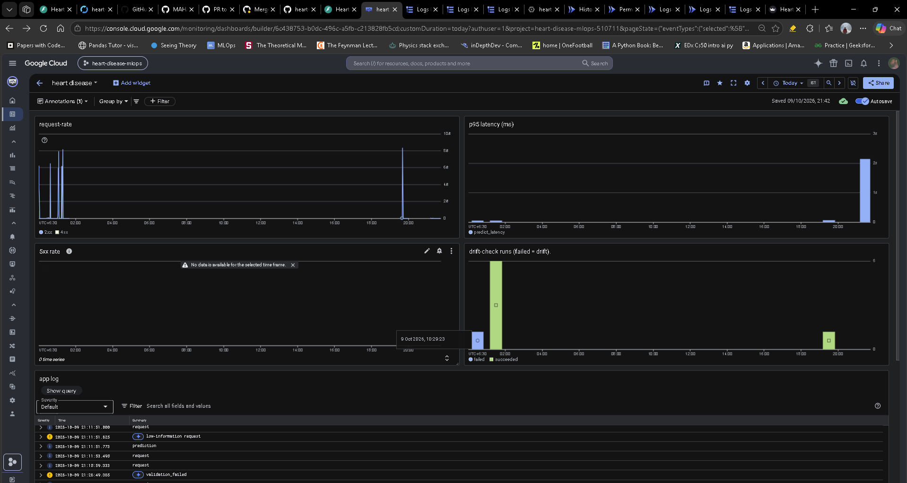

# Monitoring: logging, prediction records, metrics, alerting and drift

How the heart-disease API is observed in production: what it writes, where each signal goes, how the alert and the drift check work, and the exact commands that created them.

All commands assume:

```bash
export PROJECT_ID=<your-project-id>
export REGION=asia-south1
```

---

## 1. Overview

One request to the API leaves traces in four places. Each place answers a different question and has different readers.

| Signal | Written by | Stored in | Answers | Read by |
|---|---|---|---|---|
| Request counters | Cloud Run (automatic) | Cloud Monitoring `run.googleapis.com/request_count` | how much traffic, how many 4xx/5xx | dashboard |
| Application log lines | the app, JSON on stdout | Cloud Logging | what did the service do, how fast, what broke | engineers, log-based metrics |
| Prediction records | the app, `predlog.record()` | BigQuery `serving.predictions` | what did the model see and say | drift job, audit, future retraining |
| Drift result | `drift-check` Cloud Run job | job logs + execution status | does live input still look like training data | dashboard, weekly schedule |

```
browser ──▶ Cloud Run (heart-disease-ui, public) ──┐  x-client: ui, ID token
API client / simulator ────────────────────────────┤
                                                    ▼
                      Cloud Run (heart-disease, private) ──▶ stdout JSON ──▶ Cloud Logging ──▶ log-based metrics ──▶ dashboard + alert
                                    │
                                    └──▶ BigQuery serving.predictions ──▶ drift-check job (weekly) ──▶ exit 0 / 1 ──▶ dashboard
```

**Client tag.** Every request is labelled `ui`, `sim` or `api` from the `x-client` header (unknown or missing values become `api`). The label is on the `request` and `prediction` log lines and in the BigQuery `client` column, so demo and simulated traffic can be told apart from real API traffic.

**Privacy rule.** Patient feature values never go into application logs. Logs carry ids, timings, a row hash and the probability; the full feature row goes only to BigQuery, where access is granted per table to two service accounts.

**Why not Prometheus scraping.** The app exposes `/metrics` (Prometheus format, `src/disease_pred/metrics.py`), but Cloud Run instances are anonymous, short-lived and scale to zero, so there is nothing stable for a scraper to poll. Signals are pushed instead (logs → log-based metrics). `/metrics` stays for portability (e.g. GKE, or a collector sidecar).

---

## 2. Application logs (Cloud Logging)

### 2.1 Set-up

`src/disease_pred/logging_conf.py` formats every log record as one JSON line on stdout. Cloud Run forwards stdout to Cloud Logging, which parses each line into `jsonPayload.*` fields.

Fields added to every line:

| Field | Source |
|---|---|
| `severity` | Python log level, shown by Cloud Logging as the entry's severity |
| `logger` | logger name, e.g. `disease_pred.serve` |
| `service` | `K_SERVICE` env var (set by Cloud Run), `local` otherwise |
| `model_version` | `MODEL_VERSION` env var, e.g. `ebd6135-dvc` |
| `asctime`, `message` | standard formatter fields |

uvicorn's own handlers are replaced by the JSON handler, and `uvicorn.access` is disabled, so the request log comes only from the app's middleware (no duplicate plain-text access lines).

### 2.2 Log lines the service writes

| `message` | Logger | When | Key fields | Severity |
|---|---|---|---|---|
| `request` | `disease_pred.serve` | once per HTTP request, after the response (middleware `finally`) | `request_id`, `client`, `method`, `path`, `status`, `latency_ms` | INFO |
| `prediction` | `disease_pred.predictions` | once per scored patient (a batch of N gives N lines); `/predict`, `/predict_batch` and `/explain` all write it | `request_id`, `client`, `row_hash`, `probability`, `flag`, `n_missing` | INFO |
| `validation_failed` | `disease_pred.serve` | input rejected with 422 by pydantic validation | `request_id`, `path`, `errors[]` (`loc`, `type`, `msg`), never the input values | WARNING |
| low-information warning | `disease_pred.serve` | valid request with fewer than 3 clinical fields (also sets response header `x-low-information`) | `request_id` | WARNING |
| `bigquery insert failed` | `disease_pred.predictions` | streaming insert to BigQuery returned errors | `errors` (truncated) | ERROR |
| `unhandled error` | `disease_pred.serve` | an exception escaped the endpoint | traceback | ERROR |

Every line from one request shares the same `request_id`. It is taken from an incoming `x-request-id` header or generated, and returned to the caller in the `x-request-id` response header, together with `x-model-version`.

Order within one request: endpoint lines first (`validation_failed` or `prediction`), then the middleware's `request` line on the way out.

### 2.3 Validation-failure handler

```python
# src/disease_pred/serve.py
@app.exception_handler(RequestValidationError)
async def log_validation_error(request: Request, exc: RequestValidationError):
    """Log which fields failed and why (never the values), then return FastAPI's normal 422."""
    errors = [{"loc": [str(p) for p in e["loc"]], "type": e["type"], "msg": e["msg"]}
              for e in exc.errors()]
    log.warning("validation_failed", extra={"request_id": request_id_var.get(),
                                            "path": request.url.path, "errors": errors})
    return await request_validation_exception_handler(request, exc)
```

The handler runs inside the middleware's `call_next`, so `request_id_var` still holds the request's id and the `validation_failed` line joins to its `request` line.

The client still receives FastAPI's standard 422 body. `e["input"]` is deliberately excluded from the log.

### 2.4 Useful Logs Explorer queries

Base filter (the app's own lines only):

```
resource.type="cloud_run_revision"
resource.labels.service_name="heart-disease"
log_id("run.googleapis.com/stdout")
```

Add one line:

| To find | Add |
|---|---|
| everything for one request | `jsonPayload.request_id="<id>"` |
| rejected requests | `jsonPayload.status=422` |
| rejection reasons | `jsonPayload.message="validation_failed"` |
| rejections and their reasons together | `(jsonPayload.status=422 OR jsonPayload.message="validation_failed")` |
| slow requests | `jsonPayload.latency_ms > 1000` (number unquoted; quoted values compare as text) |
| warnings and errors | `severity>=WARNING` |
| batch calls | `jsonPayload.path="/predict_batch"` |

Lines in a query are ANDed and tested against one entry at a time. `status=422 AND message="validation_failed"` returns nothing, because those fields live on two different entries.

Cloud Run's own request log (written by Cloud Run, not the app; has `httpRequest`, no `jsonPayload`):

```
resource.type="cloud_run_revision"
resource.labels.service_name="heart-disease"
log_id("run.googleapis.com/requests")
httpRequest.status=422
```

From the CLI:

```bash
gcloud logging read \
  'resource.type="cloud_run_revision" AND jsonPayload.request_id="<id>"' \
  --limit=20 --format=json
```

---

## 3. Prediction records (BigQuery)

### 3.1 Table

Dataset `serving`, table `predictions`, region `asia-south1`.

| Column | Type | Meaning |
|---|---|---|
| `request_id` | STRING | same id as the log lines, so a log line can be joined to its rows |
| `client` | STRING | `ui`, `sim` or `api` (from `x-client`); `NULL` on rows written before the column existed |
| `ts` | TIMESTAMP | UTC time of the prediction |
| `model_version` | STRING | e.g. `ebd6135-dvc` |
| `probability` | FLOAT | predicted probability of disease |
| `flag` | BOOLEAN | `probability >= threshold` |
| `features` | JSON | the feature row the model actually saw (after cleaning; missing values as `null`) |

One row per scored patient. Rejected (422) requests and `/health` calls write nothing. `features` is a JSON column, so adding a model feature needs no schema change.

### 3.2 Commands used to create it

```bash
bq mk --location=$REGION --dataset $PROJECT_ID:serving

bq mk --table $PROJECT_ID:serving.predictions \
  request_id:STRING,ts:TIMESTAMP,model_version:STRING,probability:FLOAT,flag:BOOLEAN,features:JSON

# added later for the client tag; run before deploying code that writes it,
# otherwise inserts fail and (because errors are only logged) rows are silently lost
bq query --use_legacy_sql=false \
  'ALTER TABLE `'$PROJECT_ID'.serving.predictions` ADD COLUMN client STRING'

# the API writes rows
bq add-iam-policy-binding \
  --member="serviceAccount:sa-serving@$PROJECT_ID.iam.gserviceaccount.com" \
  --role="roles/bigquery.dataEditor" \
  $PROJECT_ID:serving.predictions

# the drift job reads rows and runs queries
bq add-iam-policy-binding \
  --member="serviceAccount:sa-trainer@$PROJECT_ID.iam.gserviceaccount.com" \
  --role="roles/bigquery.dataViewer" \
  $PROJECT_ID:serving.predictions

gcloud projects add-iam-policy-binding $PROJECT_ID \
  --member="serviceAccount:sa-trainer@$PROJECT_ID.iam.gserviceaccount.com" \
  --role="roles/bigquery.jobUser"
```

The API finds the table through the env var `PREDICTIONS_TABLE=$PROJECT_ID.serving.predictions` on the Cloud Run service. With it unset (local runs, tests) records are only logged.

Rows are written with `insert_rows_json` (streaming insert): queryable within seconds, but **not deletable for up to ~90 minutes** while they sit in the streaming buffer.

### 3.3 Useful queries

Use standard SQL (`--use_legacy_sql=false`), dots in the table name, and backticks around it (the project id contains hyphens).

```bash
# rows in the last hour
bq query --use_legacy_sql=false \
  'SELECT COUNT(*) AS n FROM `'$PROJECT_ID'.serving.predictions`
   WHERE ts >= TIMESTAMP_SUB(CURRENT_TIMESTAMP(), INTERVAL 1 HOUR)'

# per minute, in IST
bq query --use_legacy_sql=false \
  'SELECT DATETIME_TRUNC(DATETIME(ts, "Asia/Kolkata"), MINUTE) AS minute_ist, COUNT(*) AS n
   FROM `'$PROJECT_ID'.serving.predictions`
   WHERE ts >= TIMESTAMP_SUB(CURRENT_TIMESTAMP(), INTERVAL 1 HOUR)
   GROUP BY minute_ist ORDER BY minute_ist'

# the rows behind one log line
bq query --use_legacy_sql=false \
  'SELECT * FROM `'$PROJECT_ID'.serving.predictions` WHERE request_id = "<id>"'

# traffic by client in the last day
bq query --use_legacy_sql=false \
  'SELECT IFNULL(client, "unknown") AS client, COUNT(*) AS n
   FROM `'$PROJECT_ID'.serving.predictions`
   WHERE ts >= TIMESTAMP_SUB(CURRENT_TIMESTAMP(), INTERVAL 1 DAY)
   GROUP BY client'

# hourly volume, to find a bad batch before deleting it
bq query --use_legacy_sql=false \
  'SELECT TIMESTAMP_TRUNC(ts, HOUR) AS hour_utc, COUNT(*) AS n
   FROM `'$PROJECT_ID'.serving.predictions` GROUP BY hour_utc ORDER BY hour_utc'

# remove test traffic (after the streaming buffer has flushed)
bq query --use_legacy_sql=false \
  'DELETE FROM `'$PROJECT_ID'.serving.predictions` WHERE ts >= TIMESTAMP("<start, UTC>")'
```

The dataset has 7 days of time travel; a wrong delete can be recovered with `FOR SYSTEM_TIME AS OF`.

Counts in BigQuery and in the request chart differ by design: one `/predict_batch` request is one request but many rows, and 422s are requests with no rows.

---

## 4. Log-based metrics

Cloud Logging turns matching log lines into Cloud Monitoring metrics (`logging.googleapis.com/user/<name>`). They count only lines written **after** the metric was created.

### 4.1 `predict_errors` — counter of 5xx responses

```bash
gcloud logging metrics create predict_errors \
  --description="5xx responses from the prediction service" \
  --log-filter='resource.type="cloud_run_revision" AND resource.labels.service_name="heart-disease" AND jsonPayload.message="request" AND jsonPayload.status>=500'
```

### 4.2 `predict_latency` — distribution of `/predict` latency (ms)

```yaml
# ops/predict_latency_metric.yml
description: predict latency in milliseconds, from the access log
filter: >-
  resource.type="cloud_run_revision"
  AND resource.labels.service_name="heart-disease"
  AND jsonPayload.message="request"
  AND jsonPayload.path="/predict"
valueExtractor: EXTRACT(jsonPayload.latency_ms)
metricDescriptor:
  metricKind: DELTA
  valueType: DISTRIBUTION
  unit: ms
bucketOptions:
  exponentialBuckets:
    numFiniteBuckets: 20
    growthFactor: 1.5
    scale: 1
```

```bash
gcloud logging metrics create predict_latency --config-from-file=ops/predict_latency_metric.yml
gcloud logging metrics list
gcloud logging metrics describe predict_latency
```

- `valueExtractor` pulls `latency_ms` out of each matching line; `DISTRIBUTION` keeps counts per bucket, which is what makes percentiles possible.
- Buckets are exponential (edges 1, 1.5, 2.25, … ms): fine at the fast end, coarse at the slow end.
- Percentiles are **estimated** by interpolating inside a bucket. With light traffic the chart's p95 can differ from the true value (observed: chart 2.33 s, log line 3,011 ms). Exact values are in the log lines.
- The console rescales the `ms` unit automatically, so the axis may read in seconds.

---

## 5. Alert: 5xx rate

### 5.1 Notification channel

Incidents are sent to an email notification channel:

```bash
gcloud beta monitoring channels create \
  --display-name="on-call email" --type=email \
  --channel-labels=email_address=<your-email>
gcloud beta monitoring channels list --format='value(name, displayName)'
```

The `name` printed by the list command (`projects/<project-id>/notificationChannels/<channel-id>`) goes into the policy below.

### 5.2 Policy

```yaml
# ops/alert-errors.yaml
displayName: heart-disease 5xx rate
combiner: OR
notificationChannels:
  - projects/<project-id>/notificationChannels/<channel-id>
conditions:
  - displayName: more than 1 error per minute for 5 minutes
    conditionThreshold:
      filter: >-
        metric.type="logging.googleapis.com/user/predict_errors"
        AND resource.type="cloud_run_revision"
      comparison: COMPARISON_GT
      thresholdValue: 0.0167
      duration: 300s
      aggregations:
        - alignmentPeriod: 60s
          perSeriesAligner: ALIGN_RATE
```

```bash
gcloud components install alpha
gcloud alpha monitoring policies create --policy-from-file=ops/alert-errors.yaml
gcloud alpha monitoring policies list --format='table(name, displayName, enabled, notificationChannels)'
```

To change the policy later: `gcloud alpha monitoring policies update <policy-name> --policy-from-file=ops/alert-errors.yaml`.

### 5.3 How it fires

1. Every 5xx response writes a `request` line with `status >= 500`; `predict_errors` counts it.
2. `ALIGN_RATE` over 60 s turns the count into errors per second. One error per minute ≈ 0.0167/s, the threshold.
3. `duration: 300s`: the rate must stay above the threshold for 5 consecutive minutes before an incident opens. A single failed request does not page anyone.
4. When the incident opens, an email goes to the notification channel; the incident also appears under Monitoring → Alerting.
5. When the rate drops back, the incident closes automatically (and a resolution email is sent).

Alerting on a rate, not a raw count, keeps load tests from triggering it and keeps the alert from being muted.

**Optional addition: runbook text in the alert.** A `documentation` block is included in the notification email, so whoever receives it knows the first steps:

```yaml
documentation:
  content: >-
    5xx rate above 1/min for 5 min on heart-disease. Check Logs Explorer with
    severity>=ERROR, then the latest revision; roll back with
    gcloud run services update-traffic heart-disease --to-revisions=<previous>=100
  mimeType: text/markdown
```

---

## 6. Drift check (weekly Cloud Run job)

### 6.1 What it computes

`src/disease_pred/drift.py` compares the training reference (`models/reference.csv`, the exact feature frame the model was fitted on, versioned by DVC and copied into the image) with the last 7 days of `features` from BigQuery.

Rows tagged `client = 'ui'` are excluded, because the public demo UI receives arbitrary inputs from strangers that would look like drift. Simulator (`sim`), API and untagged older rows are included. In a real deployment, where the UI is how clinicians use the model, UI traffic should be included; making the exclusion an environment setting is a listed next step in the README.

For each continuous feature (`age`, `trestbps`, `chol`, `thalach`, `oldpeak`) it computes the population stability index:

PSI = Σ over bins of (a − e) · ln(a / e)

where `e` is the share of reference rows in a bin, `a` the share of current rows in the same bin, and the 10 bins are cut at the reference deciles. Empty bins are floored at `EPS = 1e-4`.

It also reports `missing_rate_shift` per feature (change in the share of missing values), which matters because the model has missing-value indicators.

| Setting | Value |
|---|---|
| window | last 7 days |
| minimum rows | 50 (fewer → `skipped`) |
| alert threshold | PSI > 0.25 |
| result | JSON line on stdout; **exit 1 if any feature drifted** |

Example output:

```json
{"status": "drift", "n_current": 2770, "psi": {...}, "missing_rate_shift": {...}, "drifted": ["oldpeak"]}
```

Exit code 1 makes the Cloud Run execution show as **failed**, so "failed" means "drift detected". It is not a crash.

### 6.2 Commands used to create and schedule it

The job runs the API image with a different command. It was created on the first release:

```bash
gcloud run jobs create drift-check \
  --image=$IMAGE \
  --region=$REGION \
  --service-account=sa-trainer@$PROJECT_ID.iam.gserviceaccount.com \
  --set-env-vars=PREDICTIONS_TABLE=$PROJECT_ID.serving.predictions,REQUIRE_MODEL=0 \
  --command=python \
  --args=-m,disease_pred.drift \
  --max-retries=0

gcloud run jobs execute drift-check --region=$REGION --wait

gcloud run jobs add-iam-policy-binding drift-check --region=$REGION \
  --member="serviceAccount:sa-trainer@$PROJECT_ID.iam.gserviceaccount.com" \
  --role="roles/run.invoker"

gcloud scheduler jobs create http drift-weekly \
  --location=$REGION \
  --schedule="0 6 * * 1" \
  --time-zone="Asia/Kolkata" \
  --uri="https://run.googleapis.com/v2/projects/$PROJECT_ID/locations/$REGION/jobs/drift-check:run" \
  --http-method=POST \
  --oauth-service-account-email=sa-trainer@$PROJECT_ID.iam.gserviceaccount.com
```

- `REQUIRE_MODEL=0`: the job needs only `reference.csv` and BigQuery, not the serving start-up checks.
- `--max-retries=0`: a drift result is not a transient failure.
- Schedule: every Monday 06:00 IST.
- Every release, `deploy.yml` runs `gcloud run jobs update drift-check --image=<new image>`, so the job always compares against the reference shipped with the live model.

### 6.3 Reading results

```bash
gcloud run jobs executions list --job=drift-check --region=$REGION --limit=5
gcloud logging read \
  'resource.type="cloud_run_job" AND resource.labels.job_name="drift-check"' \
  --limit=5 --freshness=1d --format=json
```

### 6.4 Known pitfalls

- **Test traffic pollutes the window.** Synthetic or junk requests land in BigQuery and stay in the 7-day window. UI traffic is filtered by its `client` tag; untagged junk still has to be deleted (section 3.3) before the scheduled run. The simulator tags itself `sim` and is deliberately kept in the window; its sparse payloads (age and sex only) raise missing rates, so large simulator runs can trip `missing_rate_shift`.
- **Zero-inflated features.** About 40% of real `oldpeak` values are exactly 0. Decile bins collapse onto that spike, so smearing it (e.g. by jittering simulated data) produces large PSI with no real change. Fixed bins or a separate zero bin would be more robust.
- **Dilution.** PSI compares shares. A shifted subpopulation that is a small fraction of the window may not cross 0.25.
- **Multiple testing.** Several features checked weekly will occasionally cross the threshold by chance. Prefer persistent drift (several windows) and drift in features the model relies on.

---

## 7. Dashboard

Cloud Monitoring → Dashboards → `heart disease`.



In the screenshot: short bursts of 2xx/4xx traffic, one tall p95 bar in the evening (one slow request; section 8 shows how to trace a spike like this to its cause), no 5xx data, and drift-check runs both failed (drift detected) and succeeded.

| Widget | Type | Query |
|---|---|---|
| request-rate | line | Cloud Run Revision › `request_count`, filter `service_name = heart-disease`, group by `response_code_class` (per second) |
| p95 latency (ms) | line/bar | `logging/user/predict_latency`, filter `service_name = heart-disease`, aggregation 95th percentile |
| 5xx rate | line | `request_count`, filter `response_code_class = 5xx`, aligner rate. "No data" is the healthy state |
| drift-check runs (failed = drift) | stacked bar | PromQL below, **Min step `1h`** |
| app log | logs panel | the base filter from 2.4 |

Drift widget (PromQL):

```
sum by (result) (
  increase(run_googleapis_com:job_completed_execution_count{monitored_resource="cloud_run_job", job_name="drift-check"}[1h])
)
```

The range in `[1h]` must equal the widget's Min step; otherwise windows overlap and each run is counted in many bars.

No widget should have "time range override" enabled, so that zooming one chart zooms all of them and the logs panel.

---

## 8. Investigating an incident: metric → log → request

1. On the dashboard, drag across the spike to zoom. All widgets and the logs panel narrow to that window.
2. In the logs panel, expand a line: `request_id`, `path`, `status`, `latency_ms`, `model_version`.
3. Open Logs Explorer with `jsonPayload.request_id="<id>"` to see every line of that request.
4. If it was scored, `SELECT * … WHERE request_id = "<id>"` in BigQuery shows the features and probability.

Worked example (cold start after overnight scale-to-zero):

| Time (IST) | Path | `latency_ms` | Cause |
|---|---|---|---|
| 19:38:21 | `/health` | 681 | first model load |
| 19:39:58 | `/predict` | 3,011 | first prediction: BigQuery client set-up and first-call overheads |
| after | `/predict` | tens of ms | warm instance |

Mitigations, if needed: initialise the model and BigQuery client at start-up instead of on first use, or `--min-instances=1` (costs money while idle).

---

## 9. Quick verification checklist

```bash
gcloud logging metrics list --format='value(name)'                      # predict_errors, predict_latency
gcloud alpha monitoring policies list --format='value(displayName)'      # heart-disease 5xx rate
gcloud run jobs describe drift-check --region=$REGION --format='value(spec.template.spec.template.spec.containers[0].image)'
gcloud scheduler jobs describe drift-weekly --location=$REGION --format='value(schedule, state)'
bq show --schema --format=prettyjson $PROJECT_ID:serving.predictions
bq get-iam-policy $PROJECT_ID:serving.predictions                     # sa-serving dataEditor, sa-trainer dataViewer
gcloud run services get-iam-policy heart-disease --region=$REGION       # invokers: sa-deployer, sa-ui-app; no allUsers
gcloud run services get-iam-policy heart-disease-ui --region=$REGION    # allUsers: the demo UI is public
```
